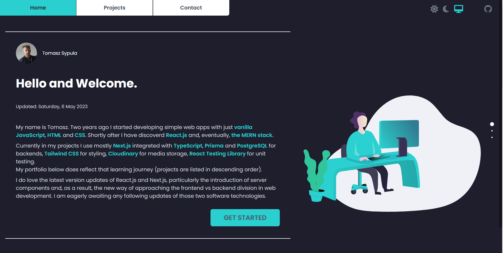

<!-- PROJECT LOGO -->
 

  

    'projects-online' is a portfolio website. It consists of the frontend and the backend sections - this repository contains its frontend source code.
        
            
     <a href="https://projects-online.vercel.app/"><strong>VIEW THE DEPLOYED WEBSITE »</strong></a>
     
        
    <a href="https://github.com/spatulatom/my-porfolio-backend"><strong>See also the backend source code of this website right here »</strong></a>
     

   
  

<!-- TABLE OF CONTENTS -->

  
Table of Contents

  <ol>
    <li><a href="#about-the-website">About The Website</a></li>
    <li><a href="#website-built-with">Website Built With</a></li>
  </ol>

<!-- ABOUT THE PROJECT -->

## About The Website

- This website contains links and descriptions of my several ongoing and completed projects:

(<a href="#readme-top">back to top</a>)

### Website Built With

- Vite for development server and for Optimized Build,
- Tailwind,
- JavaScript, TypeScript,
- Jest Testing Framework for unit testing, 
- Cloudinary for images storage and images responsiveness,
- Vercel for Deployment,
- render.com for backend  node  server deployment,
-  https://github.com/alvarotrigo/fullPage.js/ library for vertical and horizontal scroll,
- Node.js, Express.js for the backend server,
- MongoDB for contact form data storage,
- SendGrid API for sending emails,

- 'Contact page' of this project is using backend built wit Node.js, Express.js;
SendGrid API is used for sending emails. The server is running on render.com. GitHub repository of the backend is stored <a href="https://github.com/spatulatom/my-porfolio-backend"><strong>right here »</strong></a>

(<a href="#readme-top">back to top</a>)

<!-- MARKDOWN LINKS & IMAGES -->

[linkedin-shield]: https://img.shields.io/badge/-LinkedIn-black.svg?style=for-the-badge&logo=linkedin&colorB=555
[linkedin-url]: https://www.linkedin.com/in//
[product-screenshot]: images/screenshot.png
[next.js]: https://img.shields.io/badge/next.js-000000?style=for-the-badge&logo=nextdotjs&logoColor=white
[next-url]: https://nextjs.org/
[react.js]: https://img.shields.io/badge/React-20232A?style=for-the-badge&logo=react&logoColor=61DAFB
[react-url]: https://reactjs.org/
[vue.js]: https://img.shields.io/badge/Vue.js-35495E?style=for-the-badge&logo=vuedotjs&logoColor=4FC08D
[vue-url]: https://vuejs.org/
[angular.io]: https://img.shields.io/badge/Angular-DD0031?style=for-the-badge&logo=angular&logoColor=white
[angular-url]: https://angular.io/
[svelte.dev]: https://img.shields.io/badge/Svelte-4A4A55?style=for-the-badge&logo=svelte&logoColor=FF3E00
[svelte-url]: https://svelte.dev/
[laravel.com]: https://img.shields.io/badge/Laravel-FF2D20?style=for-the-badge&logo=laravel&logoColor=white
[laravel-url]: https://laravel.com
[bootstrap.com]: https://img.shields.io/badge/Bootstrap-563D7C?style=for-the-badge&logo=bootstrap&logoColor=white
[bootstrap-url]: https://getbootstrap.com
[jquery.com]: https://img.shields.io/badge/jQuery-0769AD?style=for-the-badge&logo=jquery&logoColor=white
[jquery-url]: https://jquery.com
