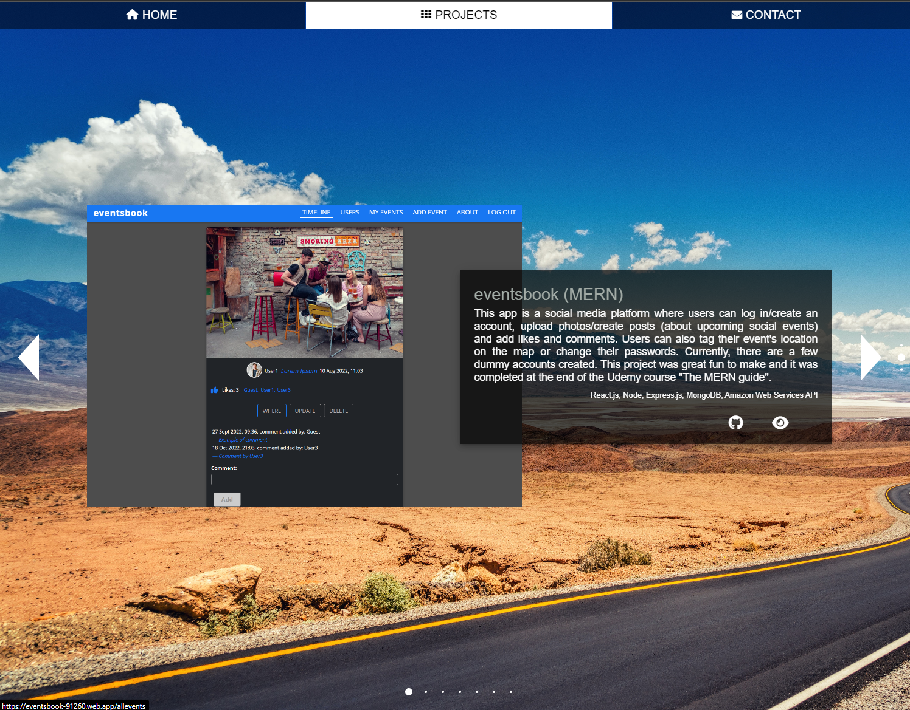

[![LinkedIn][linkedin-shield]][linkedin-url]

<!-- PROJECT LOGO -->
 

  

    'projects-online' is a portfolio website, it consists of the frontend and the backend sections - this repository contains its frontend source code.
        
        
       
     <a href="https://github.com/spatulatom/my-porfolio-backend"><strong>See also the backend source code if this website right here»</strong></a>
     
       
       
     <a href="https://spatulatom.github.io/projects-online/"><strong>View the deployed website »</strong></a>
     
   
  

<!-- TABLE OF CONTENTS -->

  
Table of Contents

  <ol>
    <li><a href="#about-the-project">About The Project</a></li>
    <li><a href="#built-with">Built With</a></li>
    <li><a href="#acknowledgments">Acknowledgments</a></li>
  </ol>

<!-- ABOUT THE PROJECT -->

## About The Project

- This website contains several ongoing and completed projects:

(<a href="#readme-top">back to top</a>)

### Built With

Contact page of this project is using backend built wit Node and Express.js,
SendGrid API is used for sending emails. GitHub repository of the backend is tored <a href="https://github.com/spatulatom/my-porfolio-backend"><strong>right here »</strong></a>

- Tailwind,
- JavaScript,
- GitHub pages for deployment,
- GitHub as a remote repository,
- Render.com for server deployment,
- SendGrid API for sending emails,
- Visual Studio Code as a local IDE & repository,
- Chrome Developer Tools for testing screen sizes and using Lighthouse,
- Chrome, Firefox, Brave Browser, Edge and Opera for browser testing the responsiveness,
- https://ui.dev/amiresponsive for testing and to make responsive image,
- https://favicon.io/favicon-generator/ to create a favicon,
- https://fontawesome.com/ for icons,
- https://tinypng.com/ to optimize images,
- https://www.remove.bg/ for removing images backgrounds,
- https://chrome.google.com/webstore/detail/pesticide-for-chrome-with/neonnmencpneifkhlmhmfhfiklgjmloi during development,
- https://wave.webaim.org/ to check web accessibility,
- https://balsamiq.com/ for wireframing.

(<a href="#readme-top">back to top</a>)

<!-- ACKNOWLEDGMENTS -->

## Acknowledgments

- https://alvarotrigo.com/fullPage/ for vertical and horizontal scrolling effect.

(<a href="#readme-top">back to top</a>)

<!-- MARKDOWN LINKS & IMAGES -->

[linkedin-shield]: https://img.shields.io/badge/-LinkedIn-black.svg?style=for-the-badge&logo=linkedin&colorB=555
[linkedin-url]: https://www.linkedin.com/in/tomasz-s-069249244/
[product-screenshot]: images/screenshot.png
[next.js]: https://img.shields.io/badge/next.js-000000?style=for-the-badge&logo=nextdotjs&logoColor=white
[next-url]: https://nextjs.org/
[react.js]: https://img.shields.io/badge/React-20232A?style=for-the-badge&logo=react&logoColor=61DAFB
[react-url]: https://reactjs.org/
[vue.js]: https://img.shields.io/badge/Vue.js-35495E?style=for-the-badge&logo=vuedotjs&logoColor=4FC08D
[vue-url]: https://vuejs.org/
[angular.io]: https://img.shields.io/badge/Angular-DD0031?style=for-the-badge&logo=angular&logoColor=white
[angular-url]: https://angular.io/
[svelte.dev]: https://img.shields.io/badge/Svelte-4A4A55?style=for-the-badge&logo=svelte&logoColor=FF3E00
[svelte-url]: https://svelte.dev/
[laravel.com]: https://img.shields.io/badge/Laravel-FF2D20?style=for-the-badge&logo=laravel&logoColor=white
[laravel-url]: https://laravel.com
[bootstrap.com]: https://img.shields.io/badge/Bootstrap-563D7C?style=for-the-badge&logo=bootstrap&logoColor=white
[bootstrap-url]: https://getbootstrap.com
[jquery.com]: https://img.shields.io/badge/jQuery-0769AD?style=for-the-badge&logo=jquery&logoColor=white
[jquery-url]: https://jquery.com
